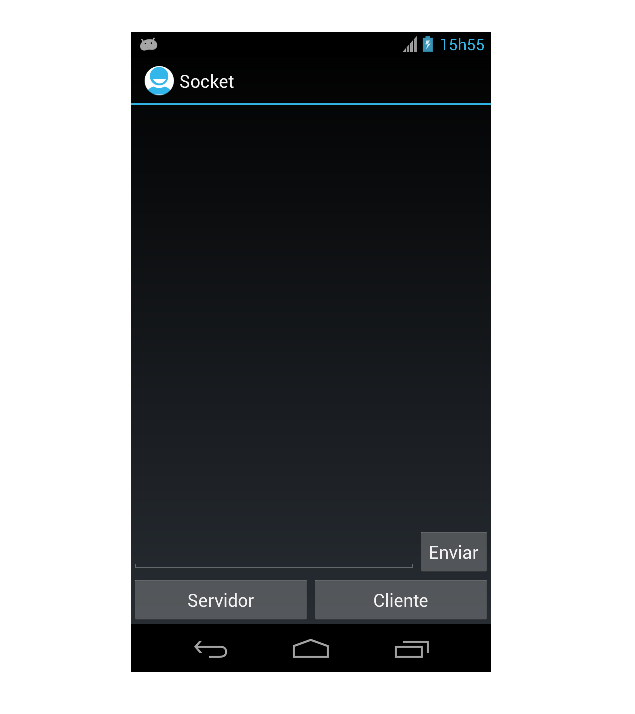

Chat-Socket-Android
===================

  

##About
Implement Chat Socket, this allows two devices with Android can send messages by Socket, one of the devices is the server 
connection and the other is the client

##Download
You can download apk in:  
[last version](https://raw.github.com/marcuspimenta/Chat-Socket-Android/blob/master/Socket/bin/Socket.apk)

##Author
Marcus Vinícius Pimenta  
email: [mvinicius.pimenta@gmail.com](mailto:mvinicius.pimenta@gmail.com)
